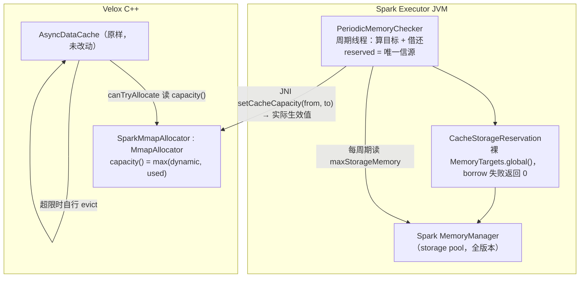

# Velox memCache Spark 内存反压 —— 设计文档 v5（动态 capacity）

- 日期：2026-07-31
- 分支：`feature/unmanaged-cache`
- 状态：**已实现**（C++ 17 例、Scala 29 例均已通过；velox 侧改动落地前 CI 编不过，见下）
- 历史：
  - v3（commit `81d01ca`/`baa2285`）：Spark 4.1 `UnmanagedMemoryConsumer` 记账 + 周期 shrink。缺陷：只支持 4.1+、不实时。
  - v4：`Cache` 装饰器逐次分配同步借额度。缺陷：热路径有开销、只能软反压。见 §9.1。
  - **v5（本文档）：`capacity()` 上报 + 三条准入路径强制，用 Spark 额度动态控制 cache 天花板。**

**不改 Spark core。velox 侧需要一处改动**：把 `MmapAllocator` 三条准入路径的容量上界参数化成入参（纯重构，旧入口转发 `capacity_`）。这一处绕不开 —— `Allocation::append` 只对三个具名 `friend` 开放，而**友元不继承**，把 `MmapAllocator` 照抄进 Gluten 编不过。见 [`2026-08-01-velox-admission-capacity-handoff.md`](2026-08-01-velox-admission-capacity-handoff.md)。其余全部在 Gluten 内。

## 0. 一句话方案

**把 `cacheAllocator_` 换成 Gluten 的子类，让 `capacity()` 返回一个可调的动态值；JVM 侧的周期线程按 Spark 的宽裕程度调它，并负责与 Spark 内存管理器借还。**

velox 的 `AsyncDataCache` 本来就会把用量约束在 `capacity()` 之内 —— 天花板降下去，它自己会淘汰旧数据。我们只是让这个天花板跟着 Spark 浮动。

### 0.1 大白话版（先读这段）

**把 cache 想成一个停车场。**

- 停车场里的车 = cache 缓存的数据
- 停车场的**大小** = `capacity()`

**今天的问题**：停车场是私建的，大小建成时定死（`memCacheSize`），公司（Spark）既不知道它存在也管不了。等公司要用地时才发现地早被占了，员工（查询）没地方干活。

**v5 的做法**：让停车场**大小可调**，并且这块地是**正式向公司登记**的。

| 场景 | 动作 |
|---|---|
| 公司地宽裕 | 先申请，批下来再扩场 |
| 公司要用地 | 先赶走车、缩场，**再按实际让出的面积退还** |

**为什么够用？** 停车场满了以后保安**本来就会**赶走旧车给新车腾位（velox 的 `makeSpace` 淘汰循环）。我们只改"停车场多大"，赶车 velox 自己会做。

**⚠️ 但不能无限缩小**：正在被人开着的车（被 pin 的 entry）赶不走。场地缩得比"正在开的车"还小，新车进不来、旧车赶不走 → 抛异常、查询失败。所以设下限 `minCacheSize`，缩到下限就不再缩。

## 1. 问题与目标

### 1.1 根因

`VeloxBackend::initCache()`（`cpp/velox/compute/VeloxBackend.cc:365-385`）用独立 `MmapAllocator`（`capacity = memCacheSize`）承载 `AsyncDataCache`，游离于 Spark 内存管理之外 —— 源码里两处 `// TODO: this is not tracked by Spark.` 即指此事。后果：executor 实际占用 = Spark 配额 + `memCacheSize`，查询侧 spill/OOM 判断全部失真。

### 1.2 目标 / 非目标

**目标**：(1) cache 占用对 Spark 可见，**全 Spark 版本**；(2) Spark 吃紧时 cache 让出并**真正归还**；(3) 用量被**硬性**约束在 Spark 允许范围内。

**非目标**：不追求 cache 与查询统一 LRU；不防整机物理 OOMKill；不解决 SSD 与 tiny entry 的记账缺口（§8）。

## 2. 关键机制（velox 侧尽调）

### 2.1 `capacity()` 是虚函数，且是 cache 分配准入的唯一依据

```cpp
// MemoryAllocator.h:291 纯虚；MmapAllocator.h:73-75 非 final、public inline override
virtual size_t capacity() const = 0;
```

`AsyncDataCache` 判断"还能不能分配"完全依据它：

```cpp
// AsyncDataCache.cpp:1041-1049，canTryAllocate
return requestBytes - acquiredBytes <=
    pageBytes(numPages(allocator_->capacity()) - allocator_->numAllocated());
```

**全仓调用 `allocator->capacity()` 仅 4 处**，与 `cacheAllocator_` 相关的只有 2 处，两处效果都是我们要的：

| 调用点 | 用途 | 降低 `capacity()` 的效果 |
|---|---|---|
| `AsyncDataCache.cpp:1048`（`canTryAllocate`） | cache 分配准入 | ✅ **核心** |
| `CachedBufferedInput.cpp:99-101` | 预读准入 | ✅ 附赠：内存紧张时少预读 |
| `Memory.cpp:167`、`:253` | 全局 `MemoryManager` 的 allocator | ⬜ 无关（是另一个 `MallocAllocator`） |

**不污染内部状态**：`MmapAllocator` 自身记账**一律直读 `capacity_` 成员**（`MmapAllocator.cpp:78/90/161/166/301/409`），从不调虚函数。size class 布局、`ensureEnoughMappedPages` 均按真实静态容量运作，只有**对外报告的数**变小。

### 2.2 天花板降下去，velox 自己会腾地方

分配入口在注册 `Cache` 后**无条件**先进 `Cache::makeSpace`（`MemoryAllocator.cpp:224-231` 等），而 `AsyncDataCache::makeSpace`（`:902-995`）是重试循环：

```
for nthAttempt in 0..kMaxAttempts-1:           # numShards_*4 = 16
    if canTryAllocate(...): if allocate(...): return true
    shards_[...]->evict(淘汰量, evictAllUnpinned = (nthAttempt >= numShards_), ...)
return false                                   # → 抛 kNoCacheSpace
```

⇒ **`capacity()` 一降，`canTryAllocate` 返回 false，`makeSpace` 自动淘汰腾地方。** v5 无需任何分配路径上的拦截。

反之 `used << capacity()` 时第一圈即通过，循环体一次不执行 —— **velox 自带淘汰在 cache 远未触顶时完全不工作**，故必须由我们压低天花板来驱动它。

### 2.3 `kNoCacheSpace`：唯一的失败模式及其可计算边界

分配彻底失败时 `AsyncDataCacheEntry::initialize`（`:154-181`）抛 `kNoCacheSpace`。

**后果致命**：velox 生产代码**无人捕获**（全仓仅 `exec/fuzzer/CacheFuzzer.cpp:497` 判过该 code）；`isRetriable` 无消费者（唯一引用 `MemoryPool.cpp:1527` 仅转发）。异常一路上抛至 Gluten 的 `JNI_METHOD_END`（`cpp/core/jni/JniError.h:31-36`）→ Java `GlutenException` → **Spark task 失败**。

**但触发条件苛刻**：需连败 16 次，而**自第 `numShards_`(=4) 次起即 `evictAllUnpinned = true`**。故触发等价于「**未 pin 的 entry 淘汰光后仍不够**」，判据：

```
capacity() < 并发读线程数 × loadQuantum
```

`loadQuantum` 默认 256MB，但**开 cache 时代码强制 ≤ 8MB**：`VeloxListenerApi.scala:88-93` 在 `COLUMNAR_VELOX_CACHE_ENABLED && LOAD_QUANTUM > 8MB` 时直接抛 `IllegalArgumentException`，executor 起不来。故按 8MB 估算，32 并发读需 256MB。（实测参照：cache 静态配 512M 运行未发现问题。）

⇒ **必须设下限 `minCacheSize`（不变式 I2）**，缩到下限即停止让路。这是必要组成部分，不是可选优化。

### 2.4 ⚠️ 无符号下溢：`capacity()` 绝不可低于 `numAllocated_`

`MachinePageCount = uint64_t`（`Allocation.h:31`）。§2.1 那段减法若 `capacity() < numAllocated_` 会**下溢成天文数字** → `canTryAllocate` 恒 true → **反转成无限放行**。`CachedBufferedInput.cpp:101` 同样模式。

⇒ 用 `capacity()` 返回值处的 `std::max` **结构性根除**（§3.2 I1），而非依赖调用顺序。

### 2.5 用量口径：热路径只读 `numAllocated_`

| 指标 | 含义 | 成本 |
|---|---|---|
| `numAllocated_`（`MemoryAllocator.h:584`，public 访问器 `MmapAllocator.h:109-111`） | 逻辑占用 | `std::atomic` 读，真 O(1) |
| `numMallocBytes()` | `::malloc` 小分配（≤3072B，`MmapAllocator.cpp:970-972`） | **非 O(1)**：`folly::ThreadCachedInt::readFull()` 需**加锁遍历所有线程**（`ThreadCachedInt.h:30-32`） |

**关键**：`allocateBytes` 只在 `initialize()` 的 `if (contiguous)` 分支被调用，而 **`contiguous` 全仓从不为 true**（`AsyncDataCache.h:632/901` 默认 false，三个调用点均未传 true）⇒ **cache 的 `numMallocBytes()` 恒为 0**。

⇒ 不用 `totalUsedBytes()` 是**零代价**的：那个加锁遍历读回来就是个 0。

**`numMapped_`（物理占用）** 跟随的是用量历史最高水位而非静态容量 —— 分配优先复用 mapped-free 页（`MmapAllocator.cpp:649-661`），稳态不增长；高水位回落后由 `shrink` 自带的 `unmap`（`AsyncDataCache.cpp:1028`）advise 掉。

### 2.6 记账通道：`GlobalOffHeapMemoryTarget`

Gluten 现成的 executor 级通道（`GlobalOffHeapMemoryTarget.scala`），直连 `MemoryManager.acquireStorageMemory` / `releaseStorageMemory` —— **Spark 1.6+ 稳定 API，无需 shim，不依赖轮询**（对比 v3 的 `UnmanagedMemoryConsumer` 仅 4.1+，且 `spark.memory.unmanagedMemoryPollingInterval` 默认 `"0s"` 即关闭轮询，导致 v3 记账在默认部署下恒为 0）。

- **必须用裸 `MemoryTargets.global()`，不可用 `GlobalOffHeapMemory.target`** —— 后者套了 `throwOnOom`（`GlobalOffHeapMemory.scala:32-36`），会把"借不到"变成抛异常；裸 target 的 `borrow` 失败返回 0（`GlobalOffHeapMemoryTarget.scala:60-95`）。
- **账本与查询天然一致**：`mode` 判据（`:38-44`）与查询侧 `MemoryTargets.newConsumer`（`MemoryTargets.java:65-71`）相同。
- `acquireStorageMemory` 只从 execution 池的 **free** 部分借，**不抢占运行中查询**；反之 Spark **无法主动收回**我们的预留（不是真实 block），故必须由 governor 主动归还。

## 3. 方案

### 3.1 职责划分：UMM 交互全在 JVM



**为什么 UMM 交互全放 JVM**：因为 C++ 侧的容量变更**在两个方向上都不需要回滚**：

| 方向 | JVM 侧顺序 | 为什么安全 |
|---|---|---|
| 涨 | `borrow()`（**可能被拒**）→ `setCapacity(reserved, target)`（**必成功且精确**） | 先拿到额度再放开容量 |
| 降 | `setCapacity(reserved, target)`（**必成功，但可能不达标**）→ `repay(实际让出量)`（**必成功**） | 先真的让出内存再还账 |

⇒ **C++ 完全不需要回调 Java**，没有 `CacheMemoryReservation` 之类的 up-call 链。

**`reserved` 是唯一信源**：JVM 记录向 Spark 借了多少，AIMD 也以它为输入——它才是"cache 占了 executor 多少内存"。native 的 `capacity()` 从不回读，接口收绝对值（`from`/`to`）而非 delta，因此不需要基准。

### 3.2 四条不变式（实现必须守住）

| # | 不变式 | 理由 | 保障方式 |
|---|---|---|---|
| **I1** | `capacity() == max(dynamic, used)` 且 `<= staticCapacity` | 低于 `used` 会无符号下溢、反转成无限放行（§2.4） | 返回值 `std::max` **结构性保证**，与调用顺序无关；上界由 `setCapacity` 的 `VELOX_CHECK_LE` 与 `MmapAllocator` 内部静态准入共同夹住 |
| **I2** | `capacity() >= minCacheSize` | 否则 pin 住的 entry 挤满 → `kNoCacheSpace` → task 失败（§2.3） | JVM 侧 `clamp`，外加启动期 fast-fail 校验（§3.7） |
| **I3** | **`reserved >= capacity()`**，除容量变动瞬间的在途分配外（§8.1） | 登记量必须覆盖 cache 可用量，否则用着没登记的内存 = 会 OOM 的方向 | 稳态由三条准入路径的原子准入保证；变动瞬间 native **如实上报**而不是拒绝，`setCapacity` 返回实际占用，JVM 据此只归还真正让出的部分（§3.5） |
| **I4** | 降容量时 `reserved -= released`，其中 `released = reserved − 返回值` | 只归还**真正让出**的部分，永不多还导致 `reserved < capacity` | JVM 侧顺序：先 `setCapacity` 后 `repay` |

**为什么是上报而不是拒绝**：I3 会被在途分配短暂打破——准入上界在进入分配函数时按值取快照，降容量够不着已经进去的调用。早期版本在这里 `VELOX_CHECK_GE(from, capacity())` 抛异常，结果**恰好堵死唯一的出路**:降容量正是逼 cache 淘汰的手段，一抛就永远出不来（`onTick` 吞掉异常，下一轮重复）。现在 native 如实返回实际占用并记一条 WARN。JVM **不为这个缺口补借**（理由见 §8.1）:更低的上界此刻已经生效，新分配一律被拒，淘汰把用量拉回来，I3 随之恢复。

**I2 推论（"多登记，少用内存"）**：由 I1，`used <= capacity()` 恒成立。两种状态：

| 状态 | `capacity()` | 余量 | `used` |
|---|---|---|---|
| `used < dynamic`（常态） | `dynamic` | `> 0` | 能涨，**上限 `dynamic`** |
| `used >= dynamic`（pin 住） | `used` | **0** | **只减不增** |

⇒ `used <= dynamic <= jvm_capacity` 恒成立，登记量始终覆盖实际用量。

### 3.3 native：`SparkMmapAllocator`

```cpp
size_t SparkMmapAllocator::capacity() const {
  return std::max(governedCapacity(), allocatedBytes());        // I1
}

size_t SparkMmapAllocator::setCapacity(size_t from, size_t to) {
  VELOX_CHECK_LE(to, staticCapacityBytes_, ...);                 // I1 上界
  // 下钳到已分配量:淘汰不掉的目标不予存下（见下）。
  // 上钳到配置大小:在途超发不得把上界永久顶高。
  const size_t target = min(max(pageAlignedDown(to), allocatedBytes()),
                            pageAlignedDown(staticCapacityBytes_));
  // from = 调用方向 Spark 登记了多少。I3 如实上报而非拒绝，见 §3.5
  governedCapacityBytes_.store(target, std::memory_order_relaxed);
  return capacity();
}
```

**要点**
- `capacity()` 在热路径被调用（每次 `canTryAllocate`），实现是两次 relaxed 原子读 + 一次 `max` —— 无锁、无系统调用。**这是全部的 native 侧开销。**
- `setCapacity` **只改数，不淘汰**。淘汰由 JNI 层在降容量前显式 `shrink`（§3.5），或由 velox 在下次分配时自然触发（§2.2）。
- **收绝对值而非 delta**。delta 需要基准，而基准只能来自 native 的回读——那正是曾经踩坑的地方（见 §3.4）。绝对值把不变式的检查也一并交给了 native：调用方传入自己登记的数，C++ 负责核对，谁也绕不过去。

### 3.4 ⚠️ 为什么接口收绝对值而不是 delta

第一版接口是 `adjustCapacity(delta)`，踩了两个 bug，根因相同：**delta 需要基准，而基准有两个候选**（`capacity()` 与 `governedCapacity()`，pin 场景下不相等）。

**bug 1**：native 以 `governedCapacity()` 为基准，JVM 读的是 `capacity()`：

```
capacity()=700MB（被 used 顶住）, governed=200MB
JVM:    delta = 200 − 700 = −500
native: governed(200) + (−500) = −300  →  VELOX_CHECK 抛异常
```

**bug 2**：修正 native 后，JNI getter 又返回了 `governedCapacity()`——三方基准仍不一致。加上 §3.6 的对账后这会变危险：pin 时 JVM 读到 200MB 而实际占 380MB，会把 180MB 还给 Spark，而 cache 还在用 ⇒ `reserved < capacity`，正是会 OOM 的方向。

⇒ **改为 `setCapacity(from, to)`，两个绝对值**。JVM 用自己的 `reserved` 当 `from`，不再回读 native，基准问题从根上消失。同时 `from` 让 native 能**报告** I3 是否被打破（打破时记 WARN，并把实际占用返回给调用方，让它只归还真正让出的部分）。

连带删除：`getCacheCapacity` JNI、`targetFor()`、JVM 侧的 `reconcile()`。

### 3.5 JNI 层：降容量前先淘汰

```cpp
// setCacheCapacity(from, to)
const auto used = allocator->allocatedBytes();
if (used > to) {
  cache->shrink(used - to);          // best-effort；shrink 断言参数 > 0
}
return allocator->setCapacity(from, to);
```

先淘汰后设容量，所以 `setCapacity` 看到的 `allocated` 已经降下来了 —— 只有真正 pin 在登记值之上、或在途分配抢跑时，返回值才会高于 `from`，那正是**一分也还不了**的情况。

### 3.6 JVM：`PeriodicMemoryChecker` —— AIMD 快减慢增

**策略前提：spill 比 cache miss 贵得多，execution 优先。** cache 是可牺牲的缓冲，重负载下退到底线是正确行为，不是缺陷。

```
onTick():
    maxStorage = SparkEnv.memoryManager.{maxOffHeap|maxOnHeap}StorageMemory
    if maxStorage <= 0: return                       # teardown（SparkEnv 已消失）

    target = nextCapacity(reserved, maxStorage)      # reserved 既是借款也是上界
    if target == reserved: return                    # 没有值得做的移动

    if target > reserved:                            # ══ 增：先借，后加
        if reservation.borrow(target − reserved) > 0:    # 全额或 0，无部分授予
            reserved = target                            # 先记账：抛了也不丢借款
            moveCapTo(target)
    else:                                            # ══ 减：先让，后还
        moveCapTo(target)

moveCapTo(target):
    applied = setCapacity(reserved, target)          # 返回实际占用，>= 真实用量
    if applied − target > step: 告警                  # pin 住或在途分配，见 §8.1
    if applied < reserved:                           # 淘汰真的让出了内存
        reservation.repay(reserved − applied)            # 先还款
        reserved = applied                               # 后改账（顺序见下）

nextCapacity(current, maxStorage):
    紧张 ⟺ current >= cacheStorageRatio × maxStorage
    紧张:   room = current − minCache
            room <= 2 × step ? minCache : current − room / 2    # 折半快减，剩不到两步就一次到底
    不紧张: min(current + step, maxCache)                        # 固定步长慢增
```

**⚠️ `maxStorage` 是 storage 池的上限，不是空闲量**：

```
maxOffHeapStorageMemory = maxOffHeapMemory − offHeapExecutionMemoryPool.memoryUsed
```

即「总量减去 execution 当前占用」= **storage 池此刻能有多大**，其中**包含已经用掉的部分**——我们自己的预留、别人缓存的 block，以及真正空闲的。

所以判据 `current >= ratio × maxStorage` 问的是「**我占的，是否超过了 storage 池的 ratio**」，分母包含分子。这是有意的:

- execution 拿得越多 → `maxStorage` 越小 → 我们固定的 `current` 占比越大 → 触发收缩。**反馈方向正确。**
- 我们自己涨不会压低 `maxStorage`（预留在 storage 侧，不在 execution 侧），故不会自激。

**已知盲区**:别的 storage 使用者（用户 `persist(OFF_HEAP)` 的 block）增减**不改变 `maxStorage`**，我们看不见，照涨不误，且涨的时候会挤掉他们的 block。这与 §9 的「可能驱逐用户块」是同一件事，已裁决接受——急减慢升令其自限。

**`maxStorage <= 0` 只可能是 teardown**:execution 的上限是 `总量 − min(storage 已用, storage 保底区)`（`UnifiedMemoryManager.computeMaxExecutionPoolSize`），故 `maxStorage >= min(storage已用, 保底区)`;而我们的预留算在 storage 已用里，**且淘汰不掉**——`freeSpaceToShrinkPool` 只能淘汰 `MemoryStore` 里的真实 block，我们是直接调 `acquireStorageMemory` 占的坑，没有对应 block。故只要持有预留，`maxStorage >= reserved > 0`。

**为什么快减慢增**：折半快减让 cache 在压力出现时**几个周期内**让开，固定小步慢增让恢复要几十个周期 —— 短暂的空档不会立刻把刚让出的内存又抢回来。

**为什么增长用固定步长而不是比例**：比例步长让大 cache 恢复得比小 cache 快，方向反了——大 cache 本来就更该谨慎。固定步长还免掉了「比例算出来小于死区导致永远长不起来」那一整类问题（早期版本必须用死区给增长步长兜底，见下）。

**`reserved` 的更新顺序**：涨时先记账后改容量，降时先还款后改账 —— 两处都遵循「宁可记多，不可记少」。中途抛异常只会留下"多登记但没用上"的浪费，下轮重试即可；反过来则会永久丢失这笔内存的记录。

**Spark 的 storage pool 只有全额或 0**（`acquireStorageMemory` 返回 Boolean），没有部分授予。被拒就原地不动，靠慢增的小步长下轮再试。

> **早期版本的教训**：增长曾是 `current × growRatio`，必须用死区给它兜底——比例在 cache 接近底线时会小于死区，那样每个 tick 都被过滤，cache **永远长不起来**。实测过：`minCache = 1GB`、`growRatio = 0.05` → 步长 51.2MB，死区若取 `max(8MB, memCacheSize × 1%)`（8GB 时 81.9MB）就会永久卡死。改成固定步长后这个耦合消失，死区也随之不再需要。

### 3.6.1 初始容量 = 配置的 cache 大小

allocator 从建出来那一刻就占着 `memCacheSize`，**没人为它付过钱**。所以启动要做的只有一件事:如实登记这个量。

```
start(): borrow(maxCacheBytes) 成功 → reserved = maxCacheBytes
                              被拒 → 抛 IllegalArgumentException，executor 起不来
```

**没有初始值计算，没有退让**。早期版本按 `maxStorageMemory × storageFraction × cacheStorageRatio` 算一个"合理的起点"，是多余的——收缩是 AIMD 的职责，不是启动的职责;而借不到就退而求其次借底线，则是把配置错误掩盖成运行期的怪异行为。

**为什么借不到必须抛**:`borrow` 全额或 0。返 0 时若把容量设成 0，cache 里只剩 pin 住的 entry，分配一律不满足 → `kNoCacheSpace` → **查询失败**（§2.3）。用"内存不够"换"查询报错"是坏交易。而且 grow 分支从 0 起步每轮只涨一步，爬回底线要几十轮，这期间查询一直在失败。

**启动路径不过 JNI**:C++ 构造时 `governedCapacityBytes_ = pageAlignedDown(options.capacity)`、`staticCapacityBytes_ = options.capacity`，两侧读的是同一个配置项，**构造即一致**，没有什么需要告诉 allocator 的。

### 3.6.2 动态特性（模拟结果）

参数：`all = 53GB, minCache = 1GB, maxCache = 8GB, cacheStorageRatio = 0.5, stepSize = 128MB`。起点即 `maxCache`（§3.6.1）。收缩折半、增长每轮一步。

| 场景 | 表现 |
|---|---|
| execution 需求有界（稳定 45GB） | 锯齿 [2.51, 4.17]GB，阈值 4GB，**利用率 ~85%** |
| execution 突增 | **3 个周期**从 8GB 退到阈值下 |
| execution 释放 | ~29 个周期恢复到 maxCache |
| **execution 持续贪婪** | **9 个周期塌到 minCache** |

最后一行是**判据自指**的结果，且是**有意接受**的：

```
execution 抢占上限 = all − min(storagePool.memoryUsed, storageRegionSize)   // UnifiedMemoryManager
我们的预留计入 storagePool.memoryUsed，故 execution 贪婪时：
    maxStorage = all − executionUsed = min(cache, region) = cache
    紧张判据   = cache >= cache × cacheStorageRatio  ⟹  恒成立
```

⇒ execution 只要还想要更多，cache 就一路退到 `minCache`。**这正是"不要 spill"的策略要求**：execution 对内存有第一优先权。

### 3.7 步长

`stepSize`（默认 128MB）一个参数管两件事：**慢增的步长**，以及**值得做的最小收缩**。

- **下界从何而来**：`CacheShard::kMinBytesToEvict = 8MB`（`AsyncDataCache.h:622`）—— `shrink` 每 shard 至少淘汰 8MB，比这更细的调整既做不到也无意义。同时避免 `maxStorageMemory` 随查询轻微波动导致的频繁借还（每次都要进 Spark `MemoryManager` 全局锁）。
- **最后一段一次走完**：折半随接近底线自然趋零，剩余不足两步时直接落到 `minCache`。这一段最不值得为它单独付一轮淘汰 + 一次 Spark 全局锁，而停在半路又会让 cache 攥着它正被要求让出的内存。所以收缩**恰好停在底线**，不是底线附近。

**`maxCache == minCache` 时 cache 永远不动** —— 底线之上没有可调空间。这是**合法配置**（等于一个固定大小、但 Spark 知情的 cache，仍然好过完全不登记），故只**告警**不拒绝启动。

> 早期版本这里是个独立的 `deadZone` 配置，且必须给增长步长兜底（§3.6）。`stepSize` 把两个角色合并后，那条耦合和对应的启动校验都不再需要。

### 3.7.1 底线的启动期校验（fast-fail）

持续压力下容量必然走到 `minCacheSize`（设计意图），所以底线本身若低于并发读所需就是个定时炸弹 —— 表现为运行期偶发 `kNoCacheSpace` 打死查询，且看起来完全不像配置错误。

```
floor(minCacheSize) >= taskSlots × ceil(loadQuantum)    # 两侧都按整页；不满足则 start 抛
```

**两侧都必须按整页算**：容量存入时向下对齐（§3.3），而分配按 `numPages` 向上取整，故按原始字节比较会放过一个「每读者短最多一页」的底线。

**不自动抬高，而是让 executor 起不来**，逼用户改配置（与 §7.1 "启动期 fail-fast、运行期容错"的划分一致）。

`loadQuantum` 无需再夹 8MB：`VeloxListenerApi.scala:88-93` 在 driver 启动时已强制 —— 开 cache 且 `loadQuantum > 8MB` 直接抛，driver 起不来。故能走到这里的必然 ≤ 8MB。

### 3.8 dynamic off-heap sizing 下的闸门

开 `spark.gluten.memory.dynamic.offHeap.sizing.enabled` 时，executor **没有固定的堆外预算**。准入判据不是 Spark 的 UMM，而是进程实际占用（`DynamicOffHeapSizingMemoryTarget.java:301-304`）：

```java
requestedSize + totalOffHeapMemory + totalOnHeapMemory >= TOTAL_MEMORY_SHARED   // Runtime.maxMemory()
```

其中 `totalOffHeapMemory` 是静态计数器 `USED_OFF_HEAP_BYTES`，**只有经过该包装的分配才会累加**。

⇒ 预留必须包这一层，否则 GB 级的 cache 对这道闸门**完全隐形**：查询算预算时以为还有空间，实际已被 cache 吃掉，进程 RSS 越过容器上限被 OOM kill。

```scala
MemoryTargets.dynamicOffHeapSizingIfEnabled(MemoryTargets.global())
```

非 dynamic 模式下该包装原样返回，行为不变。

**这是个既有缺口而非本方案引入**：`GlobalOffHeapMemory` 与全局 Arrow 分配器（`ArrowBufferAllocators.java:43`）同样绕过它，只有 task 级的走（`:80`、`ReservationListeners.java:59-60`）。区别在量级——那些是零星小块，cache 是 GB 级。

### 3.9 ⚠️ `AsyncDataCache::shutdown()` 是释放页的**唯一**途径

allocator 与 cache **互相持有**：

```
SparkMmapAllocator ──shared_ptr──→ AsyncDataCache      // registerCache（MmapAllocator.h:397）
        ↑                                │
        └──────────裸指针─────────────────┘              // AsyncDataCache::allocator_
```

⇒ **放掉外部引用什么也不会发生**（循环引用），entry 继续占着页，而 `~MmapAllocator` 在
`numAllocated_ != 0` 时**直接 abort 进程**（`MmapAllocator.cpp:63`）。

⇒ **调整成员声明顺序解决不了这个问题**（试过并被测试证伪）。唯一能打破的是
`AsyncDataCache::shutdown()` → `CacheShard::shutdown()` → `entries_.clear()`。

**保障链**（4 层，正常退出必然走到）：

```
NativeBackendInitializer.initialize()  注册 shutdown hook（:62-67）
  → SparkShutdownManagerUtil
    → JNI NativeBackendInitializer_shutdown（VeloxJniWrapper.cc:156）
      → VeloxBackend::tearDown()
        → asyncDataCache_->shutdown()          ← 唯一释放点
```

故 `tearDown()` 里那句 `shutdown()` **不是收尾清理，而是挡在 executor 退出与 abort 之间的唯一一道**。回归测试：`releasesPagesOnlyOnCacheShutdown`——先断言放掉引用后页**没有**被释放，再断言 `shutdown()` 之后释放。

### 3.10 生命周期

| 时机 | 动作 |
|---|---|
| `VeloxBackend::initCache()` | 建 `SparkMmapAllocator`（静态 = `memCacheSize`），`dynamic` 初值 = 静态值 → **未接管前行为与原生完全一致**（特性关闭时零影响）；`AsyncDataCache::create` 原样调用 |
| `VeloxListenerApi.onExecutorStart` | `PeriodicMemoryChecker.start(conf)`：校验底线（§3.7.1）→ 向 Spark 登记 `memCacheSize`（借不到即抛，§3.6.1）→ 起周期线程 |
| `VeloxListenerApi.shutdown` | `stop()`：停线程，仅此而已 —— 不动容量、不归还（§8.1）|
| `SparkShutdownManagerUtil` 的 shutdown hook（`NativeBackendInitializer:62-67` 注册） | JNI `shutdown` → `VeloxBackend::tearDown()` → **`asyncDataCache_->shutdown()`** |

## 4. 组件与改动

### 4.1 新增

| 组件 | 位置 | 职责 |
|---|---|---|
| `SparkMmapAllocator` | `cpp/velox/memory/SparkMmapAllocator.{h,cc}` | §3.3：`capacity()` / `setCapacity(from, to)` / `governedCapacity()` / `staticCapacity()` / `allocatedBytes()` |
| `SparkMmapAllocatorTest` | `cpp/velox/tests/` | 17 例，含不变式、对齐与 shutdown 契约专项 |
| `CacheStorageReservation` | `backends-velox/.../gluten/memory/` | `dynamicOffHeapSizingIfEnabled(MemoryTargets.global())`（§3.8）；`borrow` 返回 granted、不抛 |
| `CacheStorageReservationDynamicSizingSuite` | `backends-velox/src/test/.../memory/memtarget/` | 1 例：预留计入进程内存闸门。留在 `memtarget` 包里，因为它用到该包的 package-private 测试钩子 |
| `PeriodicMemoryChecker` | `backends-velox/.../memory/` | §3.6 调节算法（class 可注入依赖以便单测 + 伴生 object 接线） |
| `PeriodicMemoryCheckerSuite` | `backends-velox/src/test/` | 28 例 |

### 4.2 修改

| 组件 | 改动 |
|---|---|
| `VeloxBackend.{h,cc}` | `cacheAllocator_` 改建 `SparkMmapAllocator`，getter 返回类型同步；删掉两处 `// TODO: this is not tracked by Spark.` |
| `VeloxJniWrapper.cc` | 新增 `setCacheCapacity(from, to)`（§3.5）——JNI 面只此一个 |
| `VeloxCacheJniWrapper.java` | 同步上述声明 |
| `VeloxListenerApi.scala` | `onExecutorStart` 起 governor、`shutdown` 停 |
| `VeloxConfig.scala` | 新增 `minCacheSize` / `stepSize`（§5） |
| velox `MmapAllocator`（**上游**） | 三条准入路径的容量上界参数化成入参，见文首链接 |

### 4.3 删除（v3/v4 遗留）

`PeriodicMemoryChecker` 及其单测、`GlutenVeloxCacheConsumer` 及其两个单测、`SparkShims.registerVeloxCacheConsumer` 与 `Spark41Shims` 实现、`GlutenConfig.h` 的 `kCachePushbackRatio`。

**删除理由**：v3 的 `UnmanagedMemoryConsumer` 记账与 v5 的 storage 预留并存会**双重计账**，必须二选一。

**Spark core：0 改动。velox：一处准入容量参数化（纯重构，见文首）。**

## 5. 配置清单

| 配置 | 默认 | 说明 |
|---|---|---|
| 配置 | 默认 | 校验 | 说明 |
|---|---|---|---|
| `...cache.pushback.enabled` | `false` | — | 特性总开关（opt-in） |
| `...cache.pushback.checkIntervalMs` | `1000` | `> 0` | 调节周期 |
| `...cache.pushback.cacheRatio` | `0.5` | `(0, 1)` | 占 storage 池（**含已用**，§3.6）超过此比例即判为紧张 |
| `...cache.pushback.minCacheSize` | `512MB` | `> 0` | **容量下限（I2），防 `kNoCacheSpace`**。取法见 §2.3，启动期校验见 §3.7.1 |
| `...cache.pushback.stepSize` | `128MB` | `> 0` | 慢增的步长；收缩折半，剩余不足 `2×step` 时一次落到底线（§3.7） |

（前缀均为 `spark.gluten.sql.columnar.backend.velox`。）

**`cacheRatio` 必须是开区间 `(0, 1)`**，`checkIntervalMs` 与 `stepSize` 必须为正。后者若为 0 或负数要等到 `scheduleWithFixedDelay` 才炸，而那时初始预留已经借走了。故都在配置读取时校验，driver 端即可拦下。

> 收缩固定折半、增长固定一步，两者都不再可配。早期版本的 `shrinkRatio` / `growRatio` 除了增加配错的花样（`shrinkRatio >= 1` 会让紧张时反而去借更多内存，**算法整个反转**）没有带来什么，已删除。

## 6. 关键设计决策

1. **控制"天花板"而非"每次分配"** —— 分配路径零改动、零开销；淘汰复用 velox 自带 `makeSpace` 循环（§2.2）。
2. **UMM 交互全在 JVM，C++ 不回调 Java** —— 因为容量变更两个方向都不需要回滚（§3.1）。
3. **记账走 `acquireStorageMemory`（push）而非 `UnmanagedMemoryConsumer`（pull）** —— 全 Spark 版本可用，且不依赖默认关闭的轮询开关（§2.6）。
4. **不套 `throwOnOom`，但套 `dynamicOffHeapSizingIfEnabled`** —— 前者会把"借不到"变成异常打死查询，我们要的是返回 0；后者是 dynamic 模式下真正的进程内存闸门，不套就等于 GB 级 cache 隐形（§3.8）。
5. **I1 用返回值 `std::max` 钳位而非调用顺序约定** —— 下溢是灾难性的（行为反转），必须结构性根除（§2.4）。
6. **接口收绝对值 `setCapacity(from, to)` 而非 delta** —— delta 需要基准，而基准有两个候选、混用会移动错误的量；绝对值让 JVM 用自己的 `reserved` 当输入，基准问题从根上消失（§3.4）。
6b. **不变式 I3 由 native 无条件核对并如实上报，而非拒绝** —— 拒绝会堵死纠正动作本身（§3.5）。`from` 参数存在的理由就是让 native 能做这个核对。
6c. **`reserved` 是唯一信源，不回读 native** —— 它才是"cache 占了 executor 多少"；native 的 `capacity()` 会因 pin 而偏离，跟着它走等于登记没人付钱的内存。
7. **`minCacheSize` 是必要组成部分** —— 没有它，Spark 压力大时容量被压到并发 pin 量以下会真的打死查询（§2.3）。
7a. **启动借不到就抛，不退让** —— 把"内存不够"降级成"查询报错"是坏交易；且从 0 起步每轮只涨一步，爬回底线要几十轮（§3.6.1）。
8. **归还按 `applied` 而非 `target`** —— 电平触发，本轮没让够下轮继续，永不多还（I4）。
8a. **`stop()` 什么都不做，只停线程** —— 归还必然基于一个「返回即过期」的读数，而**再没有下一轮去纠正它**，方向恰好是危险的那一侧（谎报空闲 ⇒ 仍在运行的任务把同一块内存再拿一次；Spark 关任务池时不等待，见 `Executor.scala`）。降容量也不值得:会把正在运行的任务马上要读的 entry 淘汰掉，换来的内存是还给操作系统而不是 Spark，而进程下一刻就退出、全部自动释放。留在账上的随 executor 消失，无害。
8b. **AIMD 快减慢增，而非比例式跟随** —— 压力出现时几个周期让开，恢复要几十个周期；短暂空档不会立刻把刚让出的内存抢回（§3.6）。
8c. **接受"持续重压下退到 minCache"** —— 判据含自指（execution 的抢占上限受我们的预留限制），故 execution 只要还想要更多就一路退。这是"不要 spill"策略的直接结果，execution 有第一优先权（§3.6.2）。
9. **热路径只读 `numAllocated_`** —— 且对 cache 而言 `numMallocBytes()` 恒为 0，故这是零代价的（§2.5）。
10. **`stop()` 先于 native tearDown**，只停调节线程；释放内存是 `AsyncDataCache::shutdown()` 的事（§3.10）。

## 7. 错误处理与并发

### 7.1 错误处理

| 场景 | 行为 |
|---|---|
| cache 未启用 | JNI 判 nullptr 返 0；governor 检测到后不启动 |
| `SparkEnv.get == null`（driver / teardown） | `maxStorage` 取 0 → 跳过本周期 |
| `borrow` 被拒 | `granted = 0` → 不升容量，**不抛异常**；下周期再试 |
| `shrink` 未腾够（entry 被 pin） | `applied > target` → 少还一些，下周期继续。**不失败** |
| JNI / native 异常 | `JNI_METHOD_START/END(0L)` 兜底 |
| `onTick` 异常 | `catch NonFatal` 记 warn，线程继续 |
| shutdown | `stop()` 只停线程，不归还也不动容量 |

### 7.2 并发

- **`capacity()` 在分配热路径被并发调用**：两次 relaxed 原子读 + `max`，无锁不阻塞。
- **不存在锁序问题**：v5 不在 velox 分配路径上做任何 JNI 下探或加锁（相对 v4 的关键简化）。JNI 只发生在 governor 线程上。
- **瞬时超发有界**：dynamic capacity 仅由无同步的 `canTryAllocate` 执行（`makeSpace` 函数头注释：*"This is without synchronization"*），且 `MmapAllocator` 内部准入用静态 `capacity_`，故 `used` 可瞬时超出，上界 ≈ 并发分配线程数 × 单 entry 大小。超出后余量立即变 0（I1），**不会持续增长**，下轮收敛。
- **没有锁**：`stopped` 是 `@volatile`，这就是全部的同步——因为这就是全部的共享。`reserved` 看着像共享，其实不是:调度器建出来**之前**写一次，之后只由调度线程自己写，而 `stop()` 已经不碰它了。`stop()` 先置 `stopped` 再 `shutdownNow()`，让正在跑的那一轮自己看到标志，不必被打断。

## 8. 已知限制

1. **降容瞬间的在途分配（有界，且不会造成记账错误）**。准入容量在进入分配函数时**按值取一次快照**（`admissionCapacity`），所以 `setCapacity` 落地时，已经进入函数的线程比的仍是旧值。

   **稳态是精确的** —— 三条准入路径（非连续 / 连续 / grow）都用 `governedPages()` 走 velox 自己的原子 `fetch_add` + 回滚，实测超出 0。缝只在容量变动的那一瞬。

   **上界** = 在途请求之和 ≤ `并发线程数 × loadQuantum`，loadQuantum 开 cache 时被强制 ≤ 8MB。

   **关不死**，除非把容量和已分配量塞进同一个原子字，或者上锁 —— velox 明确避免加锁，且实测代价不划算（`folly::SharedMutex` 约 +3.2%，`std::shared_mutex` 在 16 线程下单锁 1482ns，比整个分配还贵 4 倍）。

   **但它不会造成记账错误**，因为四条串起来:

   1. 发出去的页一定进 `numAllocated_`（`fetch_add` 在检查**之前**，被拒才 `fetch_sub`）
   2. `capacity()` 返回 `max(governed, allocatedBytes)`，所以超发**藏不住**
   3. `setCapacity` 如实上报而不是拒绝，JVM 侧 `grow` 先借后抬、`shrink` 先降后还，两个方向都不需要回滚
   4. 同时 cache 的余量已经是 0，新分配全被挡，淘汰追上后自动收敛

   **不为它补账。** 上界已经是低值了，新分配一律被拒，淘汰把用量拉回来 —— 这个缺口**自己会合上**，向 Spark 多借一笔反而是拿超发去换一个更大的预留，方向是错的。只在缺口超过一个 `stepSize` 时打一条告警，见 `PeriodicMemoryCheckerSuite::does not borrow to cover a cache that outran its cap`。

   **合上靠的是 cache 自己的下一次分配，不是 checker。** cache 停在底线上时，每轮的目标恒等于 `reserved`，`adjust` 直接返回，不再下发 `shrink`。所以缺口在两种情况下才收：cache 继续被读（余量为 0，分配触发淘汰），或压力消失后 `reserved` 涨回它之上。两者都不发生 —— 压力来自别的查询、而 cache 恰好完全空闲 —— 缺口会一直挂着。上界仍然拦得住新分配，所以它不会扩大，量级也就是几个在途请求。

   > 早期版本试过补账（`reserved` 上调到实际占用），结果被迫再引入一个 `governed` 变量把「借了多少」和「上界」分开——否则一次超发就会把 cache 的上界永久抬高。而补账逻辑又必须**独立于 AIMD 的决策**，否则 cache 停在死区或底线上时每轮都被过滤、欠账永远不浮出来。这一串复杂度全部来自「要不要补账」这一个选择;选择不补，两个变量重新合一，三处绕过分支也随之消失。

   `stop()` 之后没有下一轮，所以它**什么都不做**。归还必然基于一个「返回即过期」的读数，而**再没有人会去核对**，正是危险的那一侧；还能落地多少也从这里算不出来（见下一条），所以没有任何「留一点余量」的做法是可靠的。降容量同样不值得:它会淘汰掉正在运行的任务马上要读的 entry，而释放的内存是还给操作系统、不是还给 Spark —— 进程下一刻就退出，那块内存本来就要还。留着的预留随 executor 消失，不花代价。见 `touches nothing on stop`。

2. **底线校验只在默认配置下成立**。`checkConfiguration` 用 `taskSlots × loadQuantum` 估算并发读的需求，两个产生方都罩得住，但第一个依赖默认值:

   - **prefetch 走 connector 的 IO 线程池**，大小由 `spark.gluten.sql.columnar.backend.velox.IOThreads` 配置。**默认等于 task slots**（`VeloxBackend.cc:234`），所以默认配置下没问题；**用户显式调大**则公式偏小。
   - **整文件预读不构成威胁**:`CachedBufferedInput::preload()` 虽然一次要一整个文件，但只在 `fileLength <= filePreloadThreshold` 时触发（`ReaderBase.cpp:115`），该阈值 Gluten 默认 **1MB**（velox 默认 8MB），**小于一个 loadQuantum**（强制 ≤ 8MB），被 quantum 覆盖。

   后果:把 IO 线程池调大且底线卡在临界值时，底线可能不足以容纳并发读，而 `kNoCacheSpace` 是致命且无人捕获的（§2.3）。未把 `ioThreads` 计入公式——两个池不会对同一批数据同时发起分配，相加会大幅高估，而真实的并发上界需要更细的分析。

3. **小 entry 不受管，有两档**：

   - **< `kTinyDataSize`（2048B）**:走 `std::vector`，`AsyncDataCacheEntry::initialize` 在到达 allocator **之前**就 return（`AsyncDataCache.cpp:146-149`），对 `numAllocated_`、`numMallocBytes_`、`totalUsedBytes()` **三个口径全部不可见**，也不经过 `makeSpace`。
   - **2048–3072B 且 `contiguous=true`**:走 `allocateBytes()` → `useMalloc()` 为真（`maxMallocBytes` 默认 3072，`MemoryAllocator.h:252`）→ `::malloc`，只记 `numMallocBytes_`（`MmapAllocator.cpp:493-500`）。**三个准入覆写都绕过了**，所以这条路径不受上界约束。

   第二条**目前打不到**:cache 的所有生产调用方都传 `contiguous=false`（`CachedBufferedInput.cpp:182/686`、`CacheInputStream.cpp:203`，且默认值就是 `false`），所以连续路径根本不会被走到。但它是个休眠的缺口——将来若有调用方传 `true`，2048–3072B 的 entry 就能无限突破上界。

   **堵法**：给 cache 的 allocator 设 `options.maxMallocBytes = 0`。`useMalloc()` 判的是 `bytes <= maxMallocBytes_`，置 0 后任何正数都为假（`MemoryAllocator.h:246` 注释自陈"若为 0 则忽略该值"），连带 `mallocReservedBytes_` 也归零，配置的整个大小都归页支持的 size class。**尚未做**——现状无害，且改动会动到 allocator 的构造参数，留待与上游 velox 改动一并处理。

4. **看不见别的 storage 使用者**。用户 `persist(OFF_HEAP)` 的 block 增减**不改变 `maxStorage`**（storage 池内部再分配而已），故既不构成压力信号，也拦不住我们继续涨——涨的时候还可能挤掉他们的 block（§9 已裁决接受）。

5. **`memory.untracked=true` 时信号失真**。该开关让查询的 native 内存对 Spark 完全不登记（`GlobalOffHeapMemory.scala:32-34` 用 `NoopMemoryTarget`），于是 `maxStorageMemory` 偏大、我们误判「不紧张」而继续涨。注意**我们自己的记账不受影响**（`CacheStorageReservation` 自建 `MemoryTargets.global()`，不走那个开关）。该组合本身自相矛盾（既不管内存又要按内存反压），未加告警。

6. **`scheduleWithFixedDelay` 遇 fatal error 静默停摆**。`NonFatal` 接不住 `OutOfMemoryError` 一类，调度会被永久取消且无日志。**已裁决不做**——见 `03-review-governed-cache.md`。后果有界:容量冻结在最后一次设定值，而该值已登记过，不会出现「用了没登记的内存」。

## 9. 备选方案与否决理由

### 9.1 路线 A：`Cache` 装饰器（v4 主方案，已否决）

在 `velox::memory::Cache` 装饰器的 `makeSpace` 里，每次分配前向 Spark 借额度，借不到就地 `shrink`。

| 维度 | 路线 A | **v5** |
|---|---|---|
| 热路径开销 | 每次分配一次原子读 + 分支；跨 block 时 JNI + Spark 全局锁 | **零**（额度预先谈好） |
| 反压强度 | **软** —— `shrink` 腾不动即放行、突破额度 | **软**，但方向相反 —— 腾不动就**等**，只归还真正让出的部分，额度不会被突破后留在那里（§8.1） |
| 腾空间逻辑 | 自行实现 shrink-on-reject | **复用 velox 自带 evict 循环** |
| 改动面 | 装饰器 + 记账对象 + JNI listener + 块粒度/迟滞防抖 | 覆写 `capacity()` + 三条准入路径 + 周期调节器 |

两者都是软的，但**软的方向相反**：A 腾不动就放行，额度被突破后留在那里；v5 腾不动就等，只归还真正让出的部分，登记量始终覆盖实际占用。加上热路径零开销、复用 velox 自带 evict 循环，故 A 否决。

### 9.2 其他已否决路线

| 路线 | 否决理由 |
|---|---|
| **把 cache 接进 memory manager 的 LRU 链，做同步硬反压** | **pin 决定了做不到**：任何时刻都答不出"你现在能释放多少"。同步回收要么阻塞在读者上，要么返回一个不可预测的量，memory manager 两个都没法据以决策。周期性退让 + 只归还真正让出的部分，才是 pin 允许的做法 |
| Presto 式"cache 融入全局 allocator" | Gluten 记账在 arbitrator/pool 层，要重写内存模型 |
| 改 Spark 加同步回收 | 要改 Spark core，违反约束 |
| 复用 per-task `ListenableArbitrator::shrinkCapacity` | 严格 per-task、非线程安全；cache 是 executor 级单例 |
| native-block：per-block 精确记账 | voucher / 三阶段 rollback / gate 引入记账不守恒、锁序死锁。v5 用"每轮重读真值"的电平触发根治 |
| v3：`UnmanagedMemoryConsumer` 被动上报 | 仅 4.1+，且轮询默认关闭导致记账恒为 0（§2.6） |
| v2.1：cgroup 物理压力 | 非容器/共享 cgroup 下 N 个 executor 各砍各的 → N 倍超砍 |
| 子类化 `MmapAllocator` 拦截**分配** | `*WithoutRetry` 系列为 `private`（`MmapAllocator.h:300/304/330`），派生类可覆写但**无法委托回基类**。v5 正是要覆写它们，所以这一条必须解决 —— 由 velox#18358 把准入上界参数化成 protected 的 `...WithCapacity` 重载，派生类改为委托到那里 |
| C++ 侧持有 reservation 并回调 Java | 无必要：容量变更两个方向都不需要回滚（§3.1），回调只会增加 JNI up-call 与线程附着的复杂度 |

## 10. 测试

### C++（`cpp/velox/tests/SparkMmapAllocatorTest.cc`，17 例，**已通过**）

基础：初始为静态容量、降容量、升回、超上界抛、未接管时行为与原生一致。

不变式专项：
1. **I1**：`capacity()` 覆盖 `used` 且 `<= static`；下溢验证（`headroom` 不回绕）。
2. **I2 推论**：触顶后 `headroom == 0`，`used` 只减不增。
3. **I3**：`reserved < capacity()` 时**上报而不拒绝**——容量照常移动，返回值是实际占用，JVM 据此决定还多少。
4. **目标低于 used 时不被记住**：`governed` 下钳到已分配量，所以上界**永不低于调用方登记的量**。反过来（存下那个够不着的目标）会留下一个调用方**看不见**的上界——它拿到的只是 `capacity()`，而那个值被 `max` 顶在已分配量上。压力一旦消失、目标不再移动（顶到 `maxCache` 时每轮目标恒等于 `reserved`），就再没有任何一轮会把上界抬回去:Spark 一直押着完整预留，cache 却一直被压向一个早已作废的目标。重试是调用方的事，它有返回值可依据。见 `PeriodicMemoryCheckerSuite::a blocked shrink leaves no cap behind once pressure lifts`。

集成：小容量 allocator + 真 `AsyncDataCache`，验证 `numAllocated_` 被约束在动态容量内，且降容量后自动触发淘汰（覆盖 §2.2 的核心假设）。

> **⚠️ 构建约束：`SparkMmapAllocator.cc` 必须编进测试可执行文件本身**
> （`cpp/velox/tests/CMakeLists.txt` 显式列入 SOURCES），不能只依赖
> `libvelox.so` 里的那份。
>
> `libvelox.so` 与测试可执行文件都用 `-static-libgcc -static-libstdc++`，而
> `cpp/velox/symbols.map` 把 `gluten::*`/`facebook::velox::*` 之外的符号全设为
> local —— 包括 unwinder。`nm` 可确认两侧各有一份独立的
> `_Unwind_RaiseException`/`__gxx_personality_v0`。于是 `VELOX_CHECK` 在
> `libvelox.so` 内抛出后用 .so 的 unwinder 展开，走到可执行文件的栈帧时调用了
> **可执行文件那份** `__gxx_personality_v0`，拿到的却是外来 unwinder 的
> context → `_Unwind_SetGR` **abort**（不是测试失败，是进程崩）。
>
> 生产不受影响：`setCacheCapacity` 的 throw 与 `JNI_METHOD_END` 的 catch 同在
> `libvelox.so` 内。把源文件编进测试即让 throw/catch 同域，与生产一致。
>
> 现有 Gluten 测试无一捕获过 .so 内抛出的异常（`velox_shuffle_writer_spill_test`
> 的 `ASSERT_THROW` 抛自测试内的 listener），故此坑此前未暴露。

### Scala（`PeriodicMemoryCheckerSuite` 28 例 + `CacheStorageReservationDynamicSizingSuite` 1 例，**已通过**）

**调节规则单元**（5 例）：紧张时腰斩、不低于底线、不紧张时按固定步长慢增、不超上限、**剩余不足两步时一次落到底线**。

**接线与借还**（22 例）：`maxStorage <= 0` 跳过；**减：先降容量后归还**；**增：先借后升**；**Spark 拒借时原地不动且不碰 native**（全额或 0，无部分授予）；**pin 住时只还实际让出量**；**下一轮重试补齐**；**被阻塞的收缩不留下低上界**（压力消失后仍能对齐）；**cache 自行淘汰后把差额还回去**（防预留累积泄漏，见下）；**连跑 40 轮 `reserved` 不漂移**；**超出上界时不补借**（缺口靠淘汰自行合上）；**需求见顶时稳定在阈值下方**；**execution 持续贪婪时退到底线**；无值得做的移动时完全不动；stop 只降容量不归还、幂等；异常不中断循环；三例启动期配置校验。

> **预留累积泄漏（已修，有回归测试）**：pin 住时降容量只能降到 pin 量；reader 结束后，**其他查询的分配**会触发 `makeSpace` 自动淘汰到 governed —— 这一步不经过 JVM。若每轮从 native 回读当前容量来算该还多少，那笔差额就永远回不去，且每次 pin 收缩再加一笔。实测跑 40 轮后 `reserved=420MB` 而 `capacity=272MB`，已超过初始的 400MB。
>
> 修法即 §3.6 的 `reserved` 唯一信源 + 电平触发归还。验证方式：把修复代码删掉重跑，两个回归测试立刻失败（差 156MB）。

### 编译矩阵

`-Pspark-3.3` / `-Pspark-3.5` / `-Pspark-4.1` 均需通过（v5 无 shim 依赖）。

### 需集群/压测

真实反馈回路；`minCacheSize` 与 `cacheRatio` 标定（需实测并发读线程数）；开/关 pushback 的 TPC-DS 端到端对比。

微基准见 §11（`cpp/velox/benchmarks/SparkMmapAllocatorBenchmark.cc`，已跑）。

## 11. 性能（已实测）

Benchmark：`cpp/velox/benchmarks/SparkMmapAllocatorBenchmark.cc`，Release
（gluten 与 velox 均 `-O3 -DNDEBUG`），32 核 5.5GHz，5 次重复取均值±标准差。

| 层次 | base | governed | 增量 |
|---|---|---|---|
| `capacity()` 单调 | 1.14 ns | 1.99 ns | +0.85 ns |
| `canTryAllocate()` | 1.51 ± 0.015 ns | 2.15 ± 0.047 ns | **+0.64 ns** |
| 同上 8 线程 | 1.94 ns | 2.96 ns | +1.02 ns |
| **整次 cache 分配** | **294 ± 1.83 ns** | **295 ± 2.12 ns** | **+1 ns（在噪声内）** |

**机械开销可忽略**，两个原因：
1. 调用点 `allocator_` 的静态类型是 `MemoryAllocator*`（`AsyncDataCache.h:1032`），**本来就是虚调用**，零增量。
2. `canTryAllocate` **本来就读 `numAllocated()`**，`max` 读的是同一条已经热的 cache line。

净增量 0.64 ns，与「一条 `MOV` + 一条 `CMOV`」的预估吻合。两点实测确认：

- **`max()` 哪一边胜出无关紧要**：`governed_lowered`（clamp 生效，取 `allocated`）
  2.13 ns 与 `governed`（取 governed 值）2.15 ns 无差异。
- **不引入 cache line 争用**：1→8 线程时 base 与 governed 增幅相当
  （+0.43 vs +0.84 ns），没有随线程数放大。

**调用频率 = cache miss 次数**：`findOrCreate` 命中时走 `lookupLocked` 直接返回，**不分配、不调 `capacity()`**；未命中才 `initialize()` → 分配。而 miss 粒度是 `loadQuantum`（`CacheInputStream::nextQuantizedLoadRegion`，`:395-405` 严格按它对齐切分），开 cache 时被强制 ≤ 8MB（§2.3）。

按 8MB：冷读 1TB 约 131,072 次 × 0.64ns ≈ **84 微秒**；热读全命中则**为 0**。
相对整次分配是 **+0.3%**，已低于分配本身的运行间噪声（stddev ≈ 2ns）。而 miss 本身要去 SSD/远端读数据（毫秒级），完全被淹没。

**真正的成本是 cache 变小导致命中率下降** —— 那正是这个特性要买的东西（用 cache 命中率换查询不 spill），旋钮是 `cacheRatio`。

## 12. 附录：尽调证据（file:line）

**velox（`ep/build-velox/build/velox_ep/`）**
- `capacity()` 纯虚 `MemoryAllocator.h:291`；`MmapAllocator` 非 final `MmapAllocator.h:52`、`capacity()` 非 final public inline override `:73-75`；构造函数 public `:54`。
- `capacity()` 外部调用者全集：`AsyncDataCache.cpp:1048`、`CachedBufferedInput.cpp:99-101`、`Memory.cpp:167`、`:253`。
- 内部记账只用 `capacity_` 成员：`MmapAllocator.cpp:78/90/161/166/301/409`。
- 分配无条件经 `makeSpace`：`MemoryAllocator.cpp:224-231/291-298/348-353/362-367`；`AsyncDataCache` 实际只用 `allocateBytes`（`AsyncDataCache.cpp:155`）与 `allocateNonContiguous`（`:170`）。
- `makeSpace` 重试循环 `:902-995`；`kDefaultNumShards = 4`（`AsyncDataCache.h:800`）；不持全局锁的原注释 `:913-915`。
- `kNoCacheSpace` 抛出点 `:154-181`、宏 `:27-34`；无捕获（仅 `exec/fuzzer/CacheFuzzer.cpp:497` 判过）；`isRetriable` 无消费者（`MemoryPool.cpp:1527`）。
- `shrink` 语义 `:999-1037`：`VELOX_CHECK_GT(targetBytes,0)` `:1000`，末尾 `unmap` `:1028`；`unmap → adviseAway` 自钳位 `MmapAllocator.cpp:793-814`，只减 `numMapped_` `:182-186`。
- 下溢风险：`MachinePageCount = uint64_t`（`Allocation.h:31`）；`pageBytes`/`numPages` `Allocation.h:44-50`。
- 用量口径：`numAllocated_` `MemoryAllocator.h:584`、访问器 `MmapAllocator.h:109-111`；`numMallocBytes_` 为 `folly::ThreadCachedInt` `MmapAllocator.h:390`，`readFull()` 加锁遍历（`ThreadCachedInt.h:30-32`）；`useMalloc` `MmapAllocator.cpp:970-972`，阈值默认 3072（`MemoryAllocator.h:252`）。
- `contiguous` 恒为 false：默认值 `AsyncDataCache.h:632/901`，调用点 `CachedBufferedInput.cpp:182/686`、`CacheInputStream.cpp:203`。
- tiny 旁路 `AsyncDataCache.cpp:146-149`；`kTinyDataSize = 2048` `AsyncDataCache.h:159`；`tinyEvicted` 计入淘汰 `:510`；`CacheStats.tinySize` `:547`；`updateStats` 遍历 `:649-651`。
- 分配优先复用 mapped-free 页 `MmapAllocator.cpp:649-661`；`kMinBytesToEvict = 8MB` `AsyncDataCache.h:622`。
- miss 粒度：`nextQuantizedLoadRegion` `CacheInputStream.cpp:395-405`；`lookupLocked` 命中即返回 `AsyncDataCache.cpp:251-281`。

**Gluten**
- 未记账根因与两处 TODO：`cpp/velox/compute/VeloxBackend.cc:365-385`。
- JNI 异常边界转 Java `GlutenException`：`cpp/core/jni/JniError.h:31-36`。
- `loadQuantum` 默认 256MB；开 cache 时**强制** ≤ 8MB，否则抛 `IllegalArgumentException`：`VeloxListenerApi.scala:88-93`；配置定义 `VeloxConfig.scala:652-657`；传递 `ConfigExtractor.cc:335-336`。
- `GlobalOffHeapMemoryTarget`：`borrow` 失败返 0 `:60-95`、`mode` `:38-44`；`throwOnOom` 包装（v5 **不**复用）`GlobalOffHeapMemory.scala:32-36`；裸 target 工厂 `MemoryTargets.java:40-46`；查询侧 mode 判据 `MemoryTargets.java:65-71`。
- 全局 memory manager 用默认 `MallocAllocator`：`VeloxBackend.cc:288-290`、`Memory.h:98`。

**Spark**
- `spark.memory.unmanagedMemoryPollingInterval` 默认 `"0s"` 且 0 即关闭轮询（反编译 `spark-core_2.13-4.1.0.jar` 的 `internal.config.package$` 确认）。
- `acquireStorageMemory` 只从 execution 池 free 部分借；execution 侧回收 storage 只能动 free 部分与 `MemoryStore` 可 evict block —— 我们的预留两者都不是。
- `maxOnHeapStorageMemory = maxHeapMemory − onHeapExecutionMemoryPool.memoryUsed`（动态信号源）。
